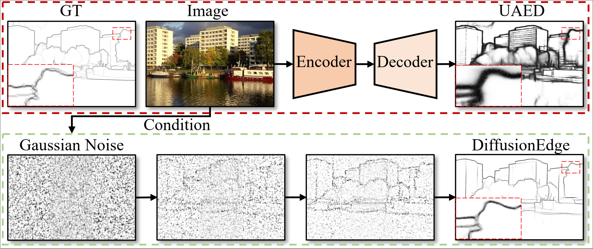
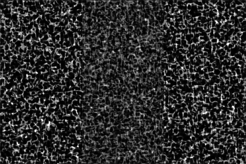
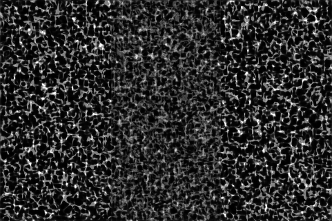

## DiffusionEdge: Diffusion Probabilistic Model for Crisp Edge Detection  ([arxiv](https://arxiv.org/abs/2401.02032))
[Yunfan Ye](https://yunfan1202.github.io), [Yuhang Huang](https://github.com/GuHuangAI), [Renjiao Yi](https://renjiaoyi.github.io/), [Zhiping Cai](), [Kai Xu](http://kevinkaixu.net/index.html).





# News
- We release a real-time model trained on BSDS, please see **[Real-time DiffusionEdge](#vi-real-time-diffusionedge)**.
- We create a [WeChat Group](https://private-user-images.githubusercontent.com/55237825/331986630-49416bbf-b919-4777-89ae-81ac0a3a14c5.jpg?jwt=eyJhbGciOiJIUzI1NiIsInR5cCI6IkpXVCJ9.eyJpc3MiOiJnaXRodWIuY29tIiwiYXVkIjoicmF3LmdpdGh1YnVzZXJjb250ZW50LmNvbSIsImtleSI6ImtleTUiLCJleHAiOjE3MTYxOTE4OTcsIm5iZiI6MTcxNjE5MTU5NywicGF0aCI6Ii81NTIzNzgyNS8zMzE5ODY2MzAtNDk0MTZiYmYtYjkxOS00Nzc3LTg5YWUtODFhYzBhM2ExNGM1LmpwZz9YLUFtei1BbGdvcml0aG09QVdTNC1ITUFDLVNIQTI1NiZYLUFtei1DcmVkZW50aWFsPUFLSUFWQ09EWUxTQTUzUFFLNFpBJTJGMjAyNDA1MjAlMkZ1cy1lYXN0LTElMkZzMyUyRmF3czRfcmVxdWVzdCZYLUFtei1EYXRlPTIwMjQwNTIwVDA3NTMxN1omWC1BbXotRXhwaXJlcz0zMDAmWC1BbXotU2lnbmF0dXJlPWEwZDA4NmM5MzUyOWU0MTY1MTRjMTFkMWEzMTYwNDYwZTc4YjIxMTNjYzQ2ZjkzM2YwMTRiODYwOTA1MzFkMmYmWC1BbXotU2lnbmVkSGVhZGVycz1ob3N0JmFjdG9yX2lkPTAma2V5X2lkPTAmcmVwb19pZD0wIn0._xQ_gP3BqQyPTVZu9vT_Mh4b3LeEFJ48MfHVdbLj9qU) for flexible discussion.
Please use WeChat APP to scan the QR code.
- 2023-12-09: The paper is accepted by **AAAI-2024**.
- Upload the pretrained **first stage checkpoint** [download](https://github.com/GuHuangAI/DiffusionEdge/releases/download/v1.1/first_stage_total_320.pt).
- Upload **pretrained weights** and **pre-computed results**.
- We now update a simple demo, please see **[Quickly Demo](#iii-quickly-demo-)**
- First Committed. 

## I. Before Starting.
1. install torch
~~~
conda create -n diffedge python=3.9
conda activate diffedge
pip install torch==1.12.1+cu113 torchvision==0.13.1+cu113 torchaudio==0.12.1 --extra-index-url https://download.pytorch.org/whl/cu113
~~~
2. install other packages.
~~~
pip install -r requirement.txt
~~~
3. prepare accelerate config.
~~~
accelerate config
~~~

## II. Prepare Data.
The training data structure should look like:
```commandline
|-- $data_root
|   |-- image
|   |-- |-- raw
|   |-- |-- |-- XXXXX.jpg
|   |-- |-- |-- XXXXX.jpg
|   |-- edge
|   |-- |-- raw
|   |-- |-- |-- XXXXX.png
|   |-- |-- |-- XXXXX.png
```
The testing data structure should look like:
```commandline
|-- $data_root
|   |-- XXXXX.jpg
|   |-- XXXXX.jpg
```

## III. Quickly Demo !
1. download the pretrained weights:  

| Dataset | ODS (<font color=blue>SEval</font>/<font color=green>CEval</font>) | OIS (<font color=blue>SEval</font>/<font color=green>CEval</font>) | AC    | Weight                                                                                 | Pre-computed results                                                                                          |
|---------|--------------------------------------------------------------------|--------------------------------------------------------------------|-------|----------------------------------------------------------------------------------------|---------------------------------------------------------------------------------------------------------------|
| BSDS    | <font color=blue>0.834</font> / <font color=green>0.749</font>     | <font color=blue>0.848</font> / <font color=green>0.754</font>     | 0.476 | [download](https://github.com/GuHuangAI/DiffusionEdge/releases/download/v1.1/bsds.pt)  | [download](https://github.com/GuHuangAI/DiffusionEdge/releases/download/v1/results_bsds_stride240_step5.zip)  |
| NYUD    | <font color=blue>0.761</font> / <font color=green>0.732</font>     | <font color=blue>0.766</font> / <font color=green>0.738</font>     | 0.846 | [download](https://github.com/GuHuangAI/DiffusionEdge/releases/download/v1.1/nyud.pt)  | [download](https://github.com/GuHuangAI/DiffusionEdge/releases/download/v1/results_nyud_stride240_step5.zip)  |
| BIPED   | <font color=blue>0.899</font>                                      | <font color=blue>0.901</font>                                      | 0.849 | [download](https://github.com/GuHuangAI/DiffusionEdge/releases/download/v1.1/biped.pt) | [download](https://github.com/GuHuangAI/DiffusionEdge/releases/download/v1/results_biped_stride240_step5.zip) |

2. put your images in a directory and run:
~~~
python demo.py --input_dir $your input dir$ --pre_weight $the downloaded weight path$ --out_dir $the path saves your results$ --bs 8
~~~
The larger `--bs` is, the faster the inference speed is and the larger the CUDA memory is.

## IV. Training.
1. train the first stage model (AutoEncoder):
~~~[inference_numpy_for_slide.py](..%2F..%2F..%2F..%2Fmedia%2Fhuang%2F2da18d46-7cba-4259-9abd-0df819bb104c%2Finference_numpy_for_slide.py)
accelerate launch train_vae.py --cfg ./configs/first_stage_d4.yaml
~~~
2. you should add the final model weight of the first stage to the config file `./configs/BSDS_train.yaml` (**line 42**), then train latent diffusion-edge model:
~~~
accelerate launch train_cond_ldm.py --cfg ./configs/BSDS_train.yaml
~~~

## V. Inference.
make sure your model weight path is added in the config file `./configs/BSDS_sample.yaml` (**line 73**), and run:
~~~
python sample_cond_ldm.py --cfg ./configs/BSDS_sample.yaml
~~~
Note that you can modify the `sampling_timesteps` (**line 11**) to control the inference speed.

## VI. Real-time DiffusionEdge.
1. We now only test in the following environment, and more details will be released soon.  

| Environment | Version | 
|-------------|---------|
| TensorRT    | 8.6.1   |  
| cuda        | 11.6    | 
| cudnn       | 8.7.0   | 
| pycuda      | 2024.1  |

Please follow this [link](https://github.com/NVIDIA/TensorRT) to install TensorRT.

2. Download the pretrained [weight](https://github.com/GuHuangAI/DiffusionEdge/releases/download/v1.1/model_crop_size_256_fps_150_ods_0813_ois_0825.trt). 
   Real-time, qi~dong!
~~~
python demo_trt.py --input_dir $your input dir$ --pre_weight $the downloaded weight path$ --out_dir $the path saves your results$
~~~

## Contact
If you have some questions, please contact with huangai@nudt.edu.cn.
## Thanks
Thanks to the base code [DDM-Public](https://github.com/GuHuangAI/DDM-Public).
## Citation
~~~
@inproceedings{ye2024diffusionedge,
      title={DiffusionEdge: Diffusion Probabilistic Model for Crisp Edge Detection}, 
      author={Yunfan Ye and Kai Xu and Yuhang Huang and Renjiao Yi and Zhiping Cai},
      year={2024},
      booktitle={AAAI}
}
~~~
