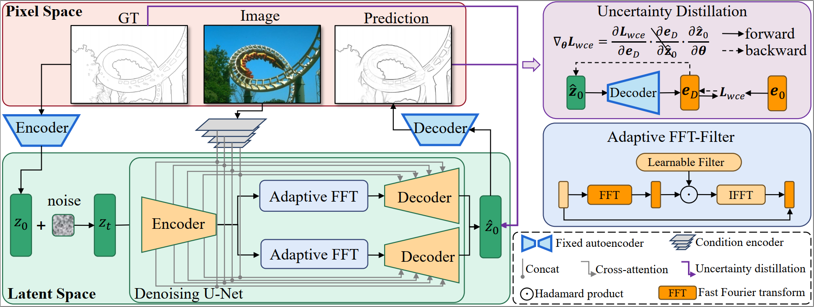

## DiffusionEdge: Diffusion Probabilistic Model for Crisp Edge Detection  ([arxiv]()


## Framework


# News
- We now update training for text-2-img, please refer to [text-2-img](#viii-training-for-text-2-iamge).
- We now modify the two-branch UNet, resulting a single-decoder UNet architecture.  
You can use the single-decoder UNet in [uncond-unet-sd](unet/uncond_unet_sd.py) and [cond-unet-sd](unet/cond_unet_sd.py).

## I. Before Starting.
1. install torch
~~~
pip install torch==1.12.1+cu113 torchvision==0.13.1+cu113 torchaudio==0.12.1 --extra-index-url https://download.pytorch.org/whl/cu113
~~~
2. install other packages.
~~~
pip install -r requirement.txt
~~~
3. prepare accelerate config.
~~~
accelerate config
~~~

## II. Prepare Data.
The file structure should look like:  
(a) unconditional cifar10:
```commandline
cifar-10-python
|-- cifar-10-batches-py
|   |-- data_batch_1
|   |-- data_batch_2
|   |-- XXX
```

(b) unconditional Celeb-AHQ:
```commandline
celebahq
|-- celeba_hq_256
|   |-- 00000.jpg
|   |-- 00001.jpg
|   |-- XXXXX.jpg
```

(c) conditional DIV2K:
```commandline
DIV2K
|-- DIV2K_train_HR
|   |-- 0001.png
|   |-- 0002.png
|   |-- XXXX.png
|-- DIV2K_valid_HR
|   |-- 0801.png
|   |-- 0802.png
|   |-- XXXX.png
```

(d) conditional DUTS:
```commandline
DUTS
|-- DUTS-TR
|   |-- DUTS-TR-Image
|   |   |-- XXX.jpg
|   |-- DUTS-TR-Mask
|   |   |-- XXX.png
|-- DUTS-TE
|   |-- DUTS-TE-Image
|   |   |-- XXX.jpg
|   |-- DUTS-TE-Mask
|   |   |-- XXX.png
```

## III. Unconditional training on image space for Cifar10 dataset.
~~~
accelerate launch train_uncond_dpm.py --cfg ./configs/cifar10/ddm_uncond_const_uncond_unet.yaml
~~~

## IV. Unconditional training on latent space for CelebAHQ256 dataset.
1. training auto-encoder:
~~~
accelerate launch train_vae.py --cfg ./configs/celebahq/celeb_ae_kl_256x256_d4.yaml
~~~
2. you should add the model weights in the first step to config file `./configs/celebahq/celeb_uncond_ddm_const_uncond_unet_ldm.yaml` (**line 41**), then train latent diffusion model:
~~~
accelerate launch train_uncond_ldm.py --cfg ./configs/celebahq/celeb_uncond_ddm_const_uncond_unet_ldm.yaml
~~~

## V. Conditional training on latent space for DIV2K dataset. (super-resolution task for example.)
1. training auto-encoder:
~~~
accelerate launch train_vae.py --cfg ./configs/super-resolution/div2k_ae_kl_512x512_d4.yaml
~~~
2. training latent diffusion model:
~~~
accelerate launch train_cond_ldm.py --cfg ./configs/super-resolution/div2k_cond_ddm_const_ldm.yaml
~~~

## VI. Conditional training on image space. (saliency detection task for example.)
~~~
accelerate launch train_cond_dpm.py --cfg ./configs/saliency/DUTS_ddm_const_dpm_114.yaml
~~~

## VII. Faster Sampling
**change the sampling steps "sampling_timesteps" in the config file**
1. unconditional generation:
~~~
python sample_uncond.py --cfg ./configs/cifar10/ddm_uncond_const_uncond_unet.yaml
python sample_uncond.py --cfg ./configs/celebahq/celeb_uncond_ddm_const_uncond_unet_ldm.yaml
~~~
2. conditional generation (Latent space model):
- Super-resolution:
~~~
python ./eval_downstream/eval_sr.py --cfg ./configs/super-resolution/div2k_sample.yaml
~~~
- Inpainting:
~~~
python ./eval_downstream/sample_inpainting.py --cfg ./configs/celebahq/celeb_uncond_ddm_const_uncond_unet_ldm_sample.yaml
~~~
- Saliency:
~~~
python ./eval_downstream/eval_saliency.py --cfg ./configs/saliency/DUTS_sample_114.yaml
~~~

## VIII. Training for Text-2-Iamge
1. download laion data from [laion](https://laion.ai/blog/laion-400-open-dataset/). 
2. download metadata using `img2dataset`, please refer to [here](https://github.com/rom1504/img2dataset). 
3. install clip. 
~~~
pip install ftfy regex tqdm
pip install git+https://github.com/openai/CLIP.git
~~~
4. The final data structure looks like:
```commandline
|-- laion
|   |-- 00000.tar
|   |-- 00001.tar
|   |-- XXXXX.tar
```
5. training with config file [text-2-img](configs/text2img/ddm_const_text.yaml). 
~~~
accelerate launch train_cond_ldm.py --cfg ./configs/text2img/ddm_uncond_const.yaml
~~~
Note that the pretrained weight of the AutoEncoder is downloaded from [here](https://ommer-lab.com/files/latent-diffusion/kl-f4.zip), and you should unzip the file.

## Concat
If you have some questions, please concat with huangai@nudt.edu.cn.
## Thanks
Thanks to the public repos: [DDPM](https://github.com/lucidrains/denoising-diffusion-pytorch) and [LDM](https://github.com/CompVis/latent-diffusion) for providing the base code.
## Citation
~~~
@article{huang2023decoupled,
  title={Decoupled Diffusion Models: Image to Zero and Zero to Noise},
  author={Huang, Yuhang and Qin, Zheng and Liu, Xinwang and Xu, Kai},
  journal={arXiv preprint arXiv:2306.13720},
  year={2023}
}
~~~